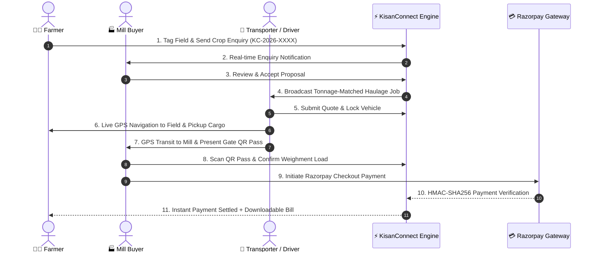

# KisanConnect 🌾
> **Agriculture Reimagined for the Digital Era • Technology Empowering Nature**

[](https://react.dev/)
[](https://tailwindcss.com/)
[](https://razorpay.com/)
[](https://leafletjs.com/)
[](https://fastapi.tiangolo.com/)
[](https://supabase.com/)
[](https://vercel.com/)
[](LICENSE)

---

## 📖 Overview

**KisanConnect** is a unified, next-generation agricultural commerce, logistics, verification, and settlement platform built to eliminate traditional supply-chain friction between **Farmers**, **Procurement Buyers & Processing Mills**, **Agro-Transport Logistics Providers**, and **Consumers**.

By bringing together **high-precision GPS farm parcel tagging**, **AI/OCR bank passbook extraction**, **direct mill discovery**, **algorithmic truck capacity matching**, **turn-by-turn driver GPS navigation**, **cryptographic QR gate pass authentication**, **Razorpay instant payment settlement**, and **real-time multilingual synchronization across 10 Indian languages**, KisanConnect establishes a transparent, trustworthy bridge from farm field to processing mill.

---

## 💡 Key Innovations & Core Modules

### 🚜 1. Farmer Portal & Smart Agriculture
* **High-Accuracy Farm GPS Geo-Tagging:** 1-tap geolocation polling (`enableHighAccuracy: true`, `timeout: 10000`) with down to `±8m` parcel precision.
* **Rural Reverse-Geocoding:** Built-in resolution for Indian villages, mandals, tehsils, and districts across all 28 states & 8 UTs.
* **Passbook OCR Verification:** AI-driven document scanning that automatically extracts bank account numbers, IFSC codes, and account holder names from passbook images or camera snaps.
* **Direct Mill Discovery:** Browse verified buyers sorted by real-time commodity prices and road distance.
* **6-Stage Shipment Tracking:** Full transparency across `PENDING` ➔ `ACCEPTED` ➔ `QR GENERATED` ➔ `IN TRANSIT` ➔ `LOAD RECEIVED` ➔ `PAYMENT SETTLED`.
* **Settlement Billing & Invoices:** Download or print official payment slips containing transaction IDs, UTR numbers, and weighment slips.
* **Weather & Mandi Intelligence:** Real-time localized weather alerts, 5-day forecasts, and commodity pricing indices.

### 🏭 2. Buyer & Mill Operator Portal
* **Live Procurement Feed:** Real-time stream of incoming supply proposals with one-click approval and transport request dispatch.
* **In-Browser Hardware QR Scanner:** Powered by `html5-qrcode` to verify arriving cargo, validate driver gate passes, and prevent adulteration or route diversion.
* **Digital Weighment Ledger:** One-click recording of gross/tare weights and automated invoice computation.
* **Razorpay Payment Gateway:** Execute trade settlements with official Razorpay Standard Checkout or instant auto-settlement test flow with HMAC-SHA256 signature verification.

### 🚛 3. Transporter & Driver Portal
* **Tonnage-Matched Job Board:** Filters haulage jobs so drivers only see orders matching or within their vehicle's rated load capacity ($\text{Truck Capacity} \ge \text{Crop Load}$).
* **Competitive Bidding:** Transporters submit haulage bids with estimated pickup ETA and per-km pricing.
* **Active GPS Turn-by-Turn Navigation:** Live interactive routing to farmer field locations and destination mill gates with speed, bearing, remaining distance, and ETA calculations.
* **Digital Gate Pass QR:** Generates a secure driver gate pass containing trip details, truck registration, and cryptographic verification payload for mill gate clearance.
* **Real-time Transit Progression:** Live status transitions: `ASSIGNED` ➔ `PICKUP_STARTED` ➔ `CROP_PICKED_UP` ➔ `IN_TRANSIT` ➔ `ARRIVED_AT_MILL`.

### 🌐 4. Accessibility & Cross-Platform Experience
* **10+ Indian Regional Languages:** Instant switching across English, Hindi (हिन्दी), Telugu (తెలుగు), Tamil (தமிழ்), Kannada (ಕನ್ನಡ), Marathi (मराठी), Gujarati (ગુજરાતી), Bengali (বাংলা), Punjabi (ਪੰਜਾਬੀ), and Malayalam (മലയാളം).
* **Mobile-First Glassmorphic Interface:** Optimized touch controls, responsive drawer sidebars, high-contrast tables, and dark/light ambient aesthetics.

---

## 🔄 End-to-End Workflow Architecture



---

## 🛠️ Technology Stack

| Domain | Technology / Library | Description |
|---|---|---|
| **Frontend Framework** | React 19 + Vite 7 | Ultra-responsive SPA with fast HMR |
| **Styling & Design** | Tailwind CSS v4 + Vanilla CSS | Modern glassmorphism, dynamic glowing accents, responsive layouts |
| **State & Navigation** | React Router v7 | Seamless client-side routing & modal overlays |
| **Payment Gateway** | Razorpay Node.js SDK & Checkout Modal | Standard Checkout & Server-side HMAC-SHA256 Verification |
| **Maps & Routing** | Leaflet + React-Leaflet + OSRM | GPS tracking, route rendering, distance/bearing calculation |
| **QR Code Engine** | `qrcode` + `html5-qrcode` | Tamper-proof QR generation and live camera barcode scanner |
| **Database & Realtime** | Supabase (PostgreSQL + Realtime Channels) | Cloud database with multi-client event broadcasting |
| **OCR Service** | Python 3.10+, FastAPI, EasyOCR, Pillow | Bank passbook image parsing (Account, IFSC, Name) |
| **Internationalization** | i18next + react-i18next | Multi-language localization across 10 Indian regional languages |
| **Deployment Platforms** | Vercel & Netlify | Serverless API handlers (`/api/*`) and SPA routing rewrites |

---

## 📁 Repository Structure

```
kisanconnect/
├── api/                           # Serverless API endpoints (Vercel & Netlify)
│   ├── create-order.js            # Razorpay order generation endpoint
│   ├── verify-payment.js          # Cryptographic signature validation
│   └── auto-success-payment.js    # Demo auto-settlement flow with valid signatures
├── new_app/                       # Main React 19 Single Page Application
│   ├── src/
│   │   ├── components/            # Portal pages, interactive modals, maps & OCR
│   │   │   ├── ActiveDeliveryNavigationMap.jsx  # Driver live GPS turn-by-turn map
│   │   │   ├── BuyerPortal.jsx                  # Mill buyer inbox & load verification
│   │   │   ├── FarmerPortal.jsx                 # Farmer dashboard & crop ledger
│   │   │   ├── TransportPortal.jsx              # Transporter job board & fleet view
│   │   │   ├── PassbookOcrUploader.jsx          # Passbook AI scanning component
│   │   │   ├── RazorpayCheckoutModal.jsx        # Razorpay payment execution
│   │   │   ├── QrScannerModal.jsx               # In-browser QR camera scanner
│   │   │   └── ...
│   │   ├── services/              # Supabase, Razorpay, Weather, and Geo services
│   │   ├── context/               # Global state providers & auth context
│   │   ├── data/                  # Offline district data & language dictionaries
│   │   └── index.css              # Custom styling & animations
│   ├── package.json
│   └── vite.config.js
├── ocr_service/                   # Standalone Python OCR Microservice
│   ├── ocr_service.py             # FastAPI backend with EasyOCR
│   └── requirements.txt           # Python dependencies
├── india_all_states_all_districts.json # Geo lookup database for rural India
├── netlify.toml                   # Netlify build and redirect configuration
├── vercel.json                    # Vercel routing and serverless function rules
├── package.json                   # Root package workspace scripts
└── README.md                      # Project documentation
```

---

## 🚀 Getting Started

### Prerequisites
* **Node.js**: v18.0.0 or higher
* **npm**: v9.0.0 or higher
* **Python**: v3.10+ *(Optional, only required if running the local OCR service)*

---

### 1. Clone the Repository

```bash
git clone https://github.com/rdg17128-eng/KISANCONNECT.git
cd KISANCONNECT
```

---

### 2. Install Frontend Dependencies

```bash
# Install root dependencies
npm install

# Install new_app dependencies
cd new_app
npm install
cd ..
```

---

### 3. Configure Environment Variables

Create a `.env` file in the `new_app` directory:

```env
# Supabase Configuration
VITE_SUPABASE_URL=https://your-supabase-id.supabase.co
VITE_SUPABASE_PUBLISHABLE_KEY=your_supabase_anon_key

# Weather & Maps Intelligence
VITE_OPENWEATHER_API_KEY=your_openweather_api_key

# Razorpay Payment Gateway Credentials
RAZORPAY_KEY_ID=rzp_test_your_key_id
RAZORPAY_KEY_SECRET=your_key_secret
VITE_RAZORPAY_KEY_ID=rzp_test_your_key_id

# Optional: OCR Microservice URL (Defaults to http://localhost:8000)
VITE_OCR_SERVICE_URL=http://localhost:8000
```

---

### 4. Run the Development Server

```bash
# Start frontend with Vite
npm run dev
```

The application will be accessible at `http://localhost:5173`.

---

### 5. (Optional) Run the Bank Passbook OCR Service

If you wish to test or run the AI passbook OCR verification service locally:

```bash
cd ocr_service
python -m venv venv

# Windows:
.\venv\Scripts\activate
# macOS/Linux:
# source venv/bin/activate

pip install -r requirements.txt
uvicorn ocr_service:app --reload --port 8000
```

---

## 🧪 Testing Razorpay Integration

Run the automated payment verification test suite:

```bash
npm test
```

This suite automatically tests:
* Input validation for sub-100 paise amounts (HTTP 400 validation).
* Detection and rejection of missing parameters.
* Cryptographic signature verification and tamper rejection.
* Live Razorpay API order creation.
* Complete auto-success payment settlement pipeline.

---

## 🌐 Production Deployment

### Deploy to Vercel
The repository includes a pre-configured [`vercel.json`](vercel.json):
1. Import the repository into your [Vercel Dashboard](https://vercel.com).
2. Set the Root Directory to `./` (or `new_app`).
3. Add your environment variables in Vercel Project Settings.
4. Deploy!

### Deploy to Netlify
The repository includes a pre-configured [`netlify.toml`](netlify.toml):
1. Connect your repository in [Netlify](https://netlify.com).
2. Set Build command to: `npm run build`
3. Set Publish directory to: `new_app/dist`
4. Add environment variables in Netlify Site Configuration.

---

## 📄 License
This project is open-source and licensed under the [MIT License](LICENSE).
